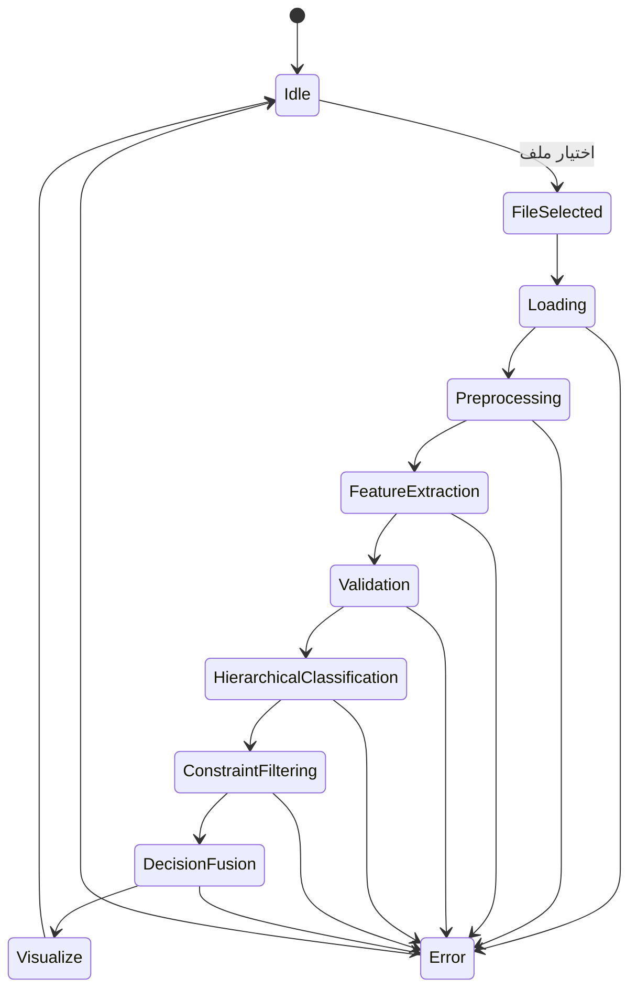
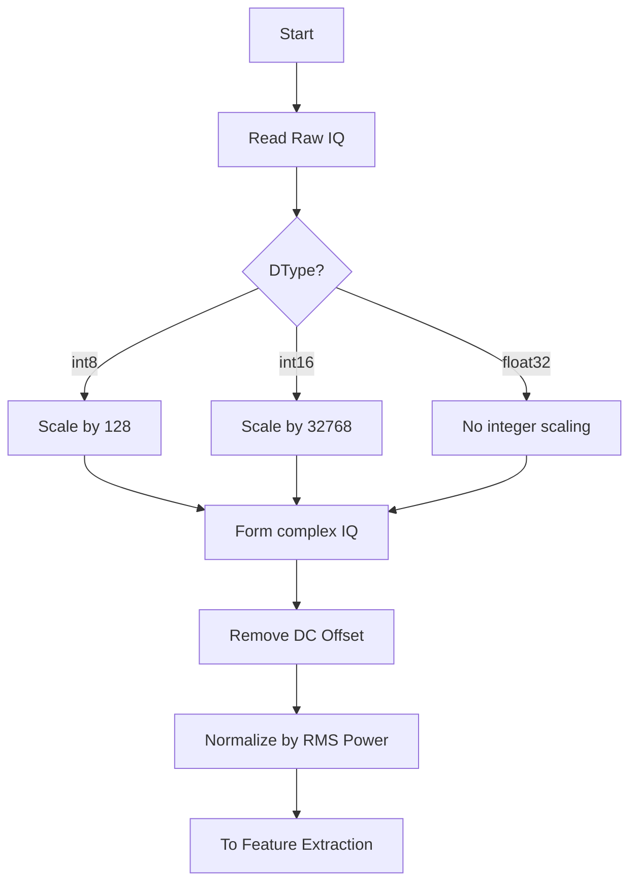
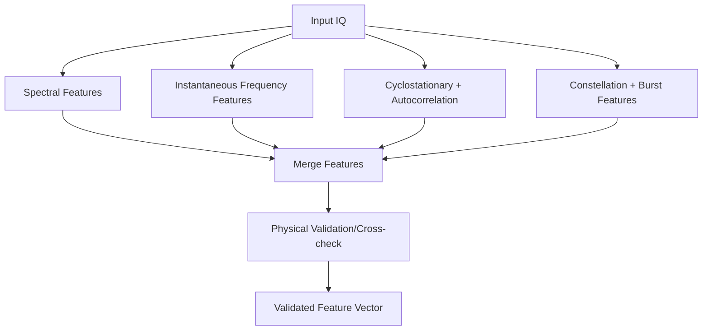
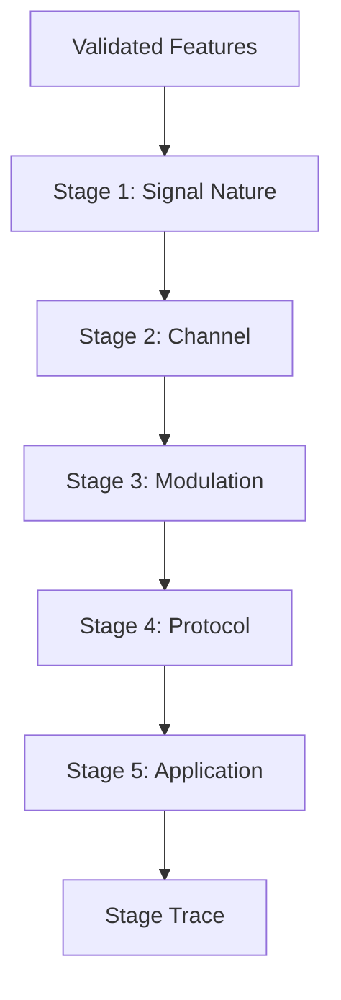
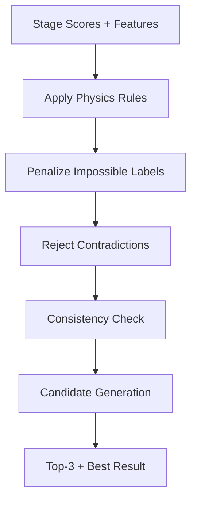
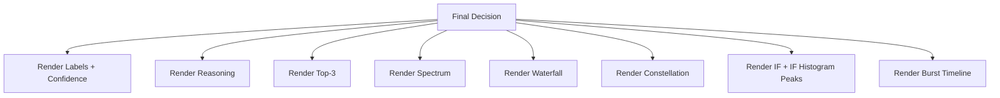

# التوثيق الرسمي لمشروع نظام تصنيف الإشارات الراديوية (RF IQ Classification)

## 1) نظرة تنفيذية

هذا المشروع هو نظام تحليل وتصنيف إشارات راديوية من ملفات IQ الخام، مبني بهيكلية معيارية قابلة للتوسعة، مع واجهة رسومية تفاعلية.

الهدف الأساسي:
- إدخال ملفات IQ خام (int8 / int16 / float32).
- استخراج مواصفات فيزيائية وإحصائية موثوقة.
- تصنيف هرمي متعدد المراحل مع قيود فيزيائية صارمة.
- إخراج نتيجة نهائية فيزيائيًا صحيحة مع أعلى 3 مرشحين ونسبة ثقة وتعليل.

مبدأ التصميم:
- الأفضلية دائمًا للصحة الفيزيائية على الثقة العالية.
- عند عدم كفاية الأدلة: الانتقال إلى فئات عامة (Unknown Signal أو Unknown Digital Signal أو Unknown Narrowband Digital Signal) بدل إعطاء تصنيف خاطئ.

---

## 2) هيكلية المشروع (Architecture)

المشروع ملتزم بالتقسيم المعياري التالي:

- iq_loader/: تحميل ملفات IQ الخام وتحويلها لمركب I+jQ ودعم التدفق (Streaming).
- preprocessing/: إزالة DC Offset والتطبيع.
- feature_extraction/: استخراج المواصفات الفيزيائية/الإحصائية (مطياف، IF، دورية، كوكبة، Burst).
- classifiers/: التصنيف الهرمي (Signal Nature -> Channel -> Modulation -> Protocol -> Application).
- protocol_detectors/: كواشف بروتوكول مبنية على ميزات (Feature-based scoring).
- constraint_engine/: قيود فيزيائية صارمة ومنطق اتساق.
- decision_engine/: دمج النتائج، حساب الثقة، حل التعارضات، إنتاج النتيجة النهائية.
- ui/: واجهة PySide6 + PyQtGraph.
- utils/: أنواع البيانات، الإعدادات، الكاش.

الملفات المحورية:
- pipeline.py: تنسيق سلسلة المعالجة كاملة.
- main.py: نقطة تشغيل الواجهة الرسومية.
- run_pipeline.py: تشغيل CLI للتصنيف.
- benchmark_latency.py: اختبار زمن الاستجابة.

---

## 3) آلية التشغيل (Runbook)

## 3.1 المتطلبات

- Python 3.13+
- الحزم الموجودة في requirements.txt

## 3.2 التثبيت

```powershell
pip install -r requirements.txt
```

## 3.3 تشغيل الواجهة الرسومية

```powershell
python main.py
```

## 3.4 تشغيل عبر CLI

```powershell
python run_pipeline.py <path_to_iq_file> --dtype int16 --fs 1000000 --chunk 100000
```

## 3.5 قياس الأداء

```powershell
python benchmark_latency.py
```

---

## 4) دورة العمل (Operational Workflow)


التتابع العملي:
1. قراءة الملف وتحويله إلى مركب I/Q.
2. إزالة انحياز DC والتطبيع.
3. استخراج المواصفات المتقدمة.
4. التحقق من صحة المواصفات مقابل قيود Nyquist والزمن الحقيقي.
5. التصنيف الهرمي متعدد المراحل.
6. تطبيق القيود الفيزيائية وإزالة التركيبات المتناقضة.
7. حساب الثقة وعرض أفضل نتيجة + أفضل 3 بدائل.

---

## 5) مخطط الحالة العام للنظام



---

## 6) مخططات تدفقية لكل حالة تشغيل رئيسية

## 6.1 حالة التحميل والمعالجة الأولية



## 6.2 حالة استخراج المواصفات



## 6.3 حالة التصنيف الهرمي



## 6.4 حالة القيود الفيزيائية وحل التعارض



## 6.5 حالة عرض النتائج وDebug



---

## 7) كيفية استخلاص المواصفات (Feature Extraction Methodology)

## 7.1 المواصفات الطيفية

- تحويل FFT باستخدام fs الحقيقي.
- حساب PSD ثم:
  - spectral_entropy
  - spectral_flatness
  - peak_to_avg
  - subcarrier_structure
- bandwidth_hz:
  - تقدير أساسي بالـ percentile (1%..99%).
  - تقدير occupied BW على أساس مستوى فوق أرضية الضجيج.
  - Clamp نهائي ضمن [0, sample_rate].

## 7.2 مواصفات IF

- استخراج التردد اللحظي من مشتقة الطور غير الملتف.
- تنعيم IF قبل التحليل.
- تجاهل عينات الطاقة المنخفضة عند بناء IF histogram.
- تنعيم Gaussian للهستوغرام.
- كشف قمم Robust مع فصل أدنى بين القمم.
- مؤشرات أساسية:
  - if_std
  - if_skew
  - if_peak_count
  - chirp_linearity
  - multi_fsk_score

## 7.3 المواصفات الدورية والارتباط

- cyclic_strength من طيف |x|^2.
- autocorr_peak من الارتباط الذاتي المطبع زمنيًا.
- cyclic_autocorr_peak من الارتباط الدوري.
- symbol_lag_samples ثم symbol_rate_est_hz (بعد التحقق الفيزيائي).

## 7.4 مواصفات الكوكبة والـ Burst

- K-means على نقاط الكوكبة لاشتقاق constellation_stability.
- كشف Burst من envelope threshold.
- packet_rate_hz = عدد البدايات الصحيحة / مدة الإشارة بالثواني.
- snr_db و amplitude_stability.
- ook_score و burstiness.

---

## 8) التحقق الفيزيائي الصارم (Strict Physical Validation)

القواعد الأساسية:
- bandwidth_hz <= sample_rate.
- symbol_rate_est_hz < sample_rate / 2.
- packet_rate_hz يجب أن يكون محسوبًا من الزمن الحقيقي.
- أي قيمة غير فيزيائية:
  - يتم ضبطها أو تصفيرها.
  - تُوسم كـ invalid.
  - تُخفض feature_validity_score و core_feature_validity_score.

مؤشرات صحة الميزات:
- bandwidth_valid
- symbol_rate_valid
- packet_rate_valid
- feature_invalid_count
- core_feature_invalid_count
- feature_validity_score
- core_feature_validity_score

---

## 9) منطق التصنيف الهرمي

## 9.1 Stage 1: Signal Nature

الفئات:
- Noise
- Analog
- Digital

مبدأ حاسم:
- وجود cyclic أو structure رقمي يضعف Noise وAnalog ويرجح Digital.

## 9.2 Stage 2: Channel

الفئات:
- Narrowband
- Wideband
- Spread

قواعد:
- Narrowband عندما BW < 100 kHz.
- Wideband عندما BW > 1 MHz.
- Spread فقط عند تأكيد chirp أو DSSS.

## 9.3 Stage 3: Modulation

الفئات:
- AM, FM, FSK, PSK, QAM, OFDM, Chirp, OOK, MFSK

قاعدة صارمة:
- إذا nature = Digital، لا يسمح بـ AM/FM.

## 9.4 Stage 4: Protocol (Feature-based)

الفئات:
- WiFi-like
- LoRa-like
- DMR-like
- RC-like
- Drone-link-like
- Analog Broadcast
- Unknown Digital Signal
- Unknown Narrowband Digital Signal
- Unknown Signal

## 9.5 Stage 5: Application

الفئات:
- Voice
- Data
- Control

---

## 10) محرك القيود الفيزيائية (Constraint Engine)

أمثلة قواعد مفعلة:
- Narrowband -> ليس OFDM.
- Narrowband -> ليس WiFi-like.
- لا chirp -> ليس LoRa-like.
- IF peaks ضعيفة -> تخفيض FSK/MFSK.
- constellation stability منخفضة -> تخفيض QAM/PSK.
- cyclic قوي -> رفض Noise.
- Digital -> لا AM/FM.

النتيجة:
- إزالة التركيبات المستحيلة.
- المحافظة على التركيبات المتسقة فيزيائيًا فقط.

---

## 11) نموذج الثقة (Confidence Model)

الثقة تعتمد على:
- score الهرمي المركب.
- feature agreement.
- stage consistency.
- constraint satisfaction.
- signal quality (SNR, stability).
- stage alignment.
- عامل عقابي ثقيل عند انخفاض core_feature_validity_score.

سياسة الأمان:
- عند ضعف صحة الميزات الأساسية، يتم خفض الثقة جذريًا.
- تفضيل Unknown Signal على أي تصنيف محدد خاطئ.

---

## 12) مخرجات النظام

الإخراج الأساسي:
- Signal Type
- Channel Type
- Modulation
- Protocol
- Application
- Confidence %

الإخراج التحليلي:
- Top 3 candidates
- Feature summary
- Stage trace
- Detailed reasoning

---

## 13) الرسومات التشخيصية (Debug/Validation Plots)

الواجهة تعرض:
- Time Domain
- Spectrum (FFT)
- Waterfall
- Constellation
- Instantaneous Frequency
- IF Histogram + Peaks
- Packet/Burst Timeline

استخدامها:
- التحقق بصريًا من صحة عرض الطيف مقابل fs.
- فحص IF peaks لتأكيد/نفي FSK/MFSK.
- فحص الاستمرارية والبنية الحزمية.
- فحص تشتت الكوكبة لتمييز QAM/PSK.

---

## 14) الأداء والاعتمادية

- اعتماد NumPy vectorization في المسارات الحرجة.
- استخدام multiprocessing للأحجام الكبيرة فقط لتجنب overhead.
- كاش LRU لتجنب إعادة حساب الميزات.
- معالجة Streaming للملفات الكبيرة.

الهدف التشغيلي:
- استجابة سريعة وعملية على 100k إلى 1M عينة.

---

## 15) اعتماد رسمي واختبارات قبول

يعتبر النظام مطابقًا للاعتماد التشغيلي عندما يحقق:
1. لا يخرج نتائج فيزيائيًا مستحيلة.
2. لا يتجاوز bandwidth_hz قيمة sample_rate.
3. لا يخرج symbol_rate_est_hz أكبر أو يساوي sample_rate/2.
4. packet_rate_hz مشتق من الزمن الحقيقي دائمًا.
5. عند ضعف الأدلة: ينتقل إلى Unknown Signal/Unknown Digital Signal بدل overfit.
6. Top-3 والتعليل متوفران دائمًا.

---

## 16) خريطة صيانة وتوسعة مستقبلية

- إضافة كاشف بروتوكول جديد:
  - تسجيل detector جديد داخل protocol_detectors/.
  - تعديل stage protocol weighting فقط دون كسر باقي المراحل.
- إضافة ميزة جديدة:
  - إضافتها في feature_extraction/ مع حقول validation اللازمة.
  - ربطها في classifiers/decision_engine.
- إضافة نموذج ML لاحقًا:
  - يندمج كطبقة scoring إضافية قبل constraint_engine، مع إبقاء القيود الفيزيائية كطبقة نهائية إلزامية.

---

## 17) مرجع سريع للملفات

- [pipeline.py](pipeline.py): منسق المعالجة الكامل.
- [feature_extraction/core.py](feature_extraction/core.py): استخراج وvalidation الميزات.
- [classifiers/hierarchical.py](classifiers/hierarchical.py): التصنيف الهرمي.
- [constraint_engine/physics_rules.py](constraint_engine/physics_rules.py): القيود الفيزيائية.
- [decision_engine/engine.py](decision_engine/engine.py): القرار النهائي والثقة.
- [protocol_detectors/detectors.py](protocol_detectors/detectors.py): كواشف البروتوكولات العامة.
- [ui/main_window.py](ui/main_window.py): واجهة العرض والتحليل.

---

هذا المستند هو المرجع الرسمي المعتمد للبنية والمنطق التشغيلي والفيزيائي للمشروع.
